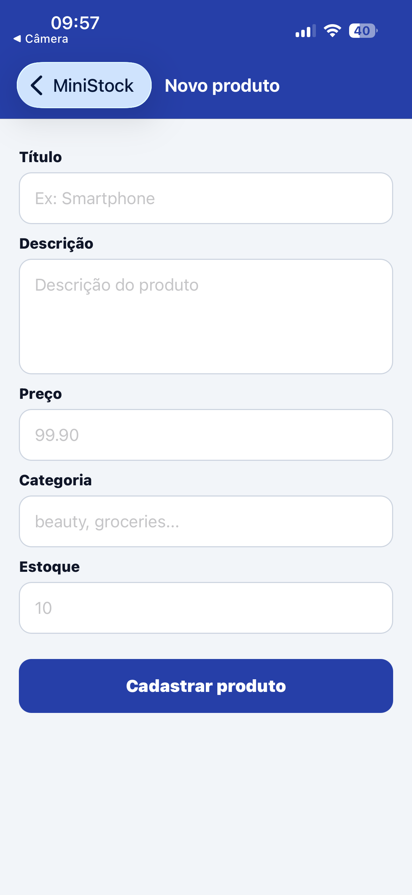
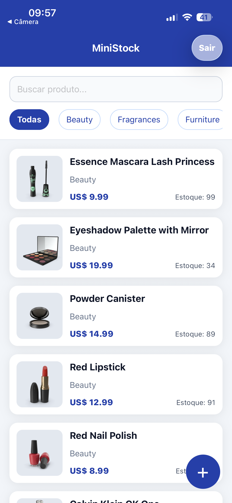
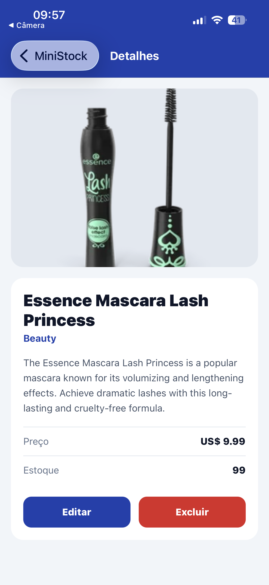

# MiniStock Mobile

Aplicativo mobile em React Native com Expo para controle de produtos da loja MiniStock, consumindo a API pública DummyJSON com axios.

## Funcionalidades

- Login com persistência de token em AsyncStorage.
- Listagem de produtos com FlatList, paginação infinita e pull to refresh.
- Busca textual e filtro por categoria.
- Tela de detalhes do produto.
- Cadastro, edição e exclusão com confirmação.
- Logout funcional.
- Tratamento de loading, erro e estado vazio.

## Tecnologias

- React Native com Expo
- axios
- React Navigation native-stack
- AsyncStorage

## Credenciais de teste

```txt
Usuário: emilys
Senha: emilyspass
```

## Instalação

```bash
npm install
npx expo start
```

Depois, abra no Expo Go pelo QR Code ou use:

```bash
npm run android
npm run ios
npm run web
```

## Organização

```txt
src/
  components/
  contexts/
  navigation/
  screens/
  services/
```

A camada `src/services` centraliza todas as chamadas HTTP. As telas não usam `axios.get`, `axios.post`, `axios.put` ou `axios.delete` diretamente.

## Requisitos de axios atendidos

- Instância única em `src/services/api.js`.
- `baseURL` e `timeout` configurados.
- Interceptor de request com token Bearer automático.
- Interceptor de response para 401, 404, 5xx e timeout/rede.
- Uso de `params` nas query strings.
- Chamadas com `async/await`, `try/catch/finally` nas telas e contextos.

## Observação sobre a DummyJSON

As rotas de cadastro, edição e exclusão são simuladas pela API. Por isso, o app atualiza o estado local da listagem após cada operação concluída com sucesso.


## Capturas de tela





